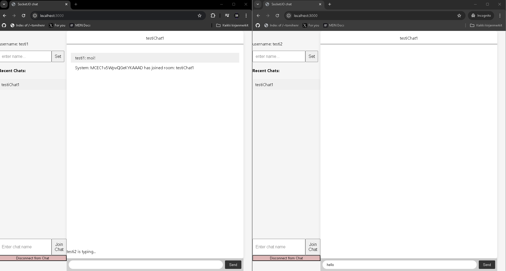
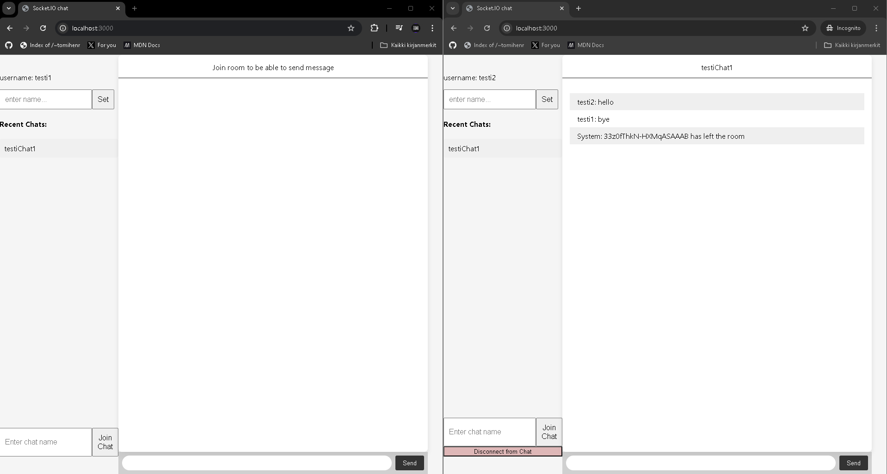
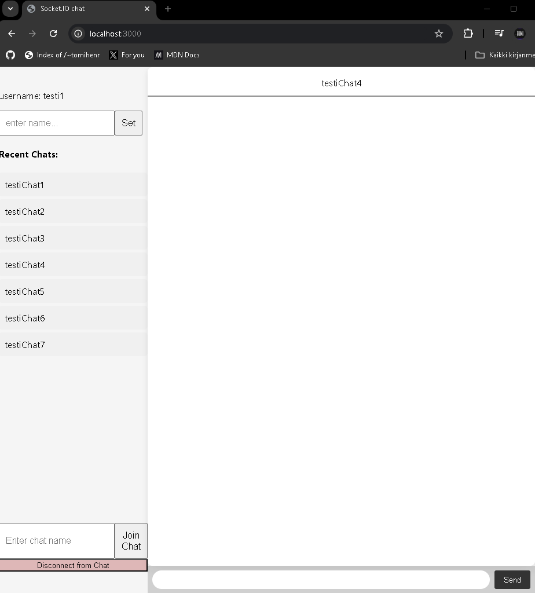

1. Explain namespaces in Socket.IO? How they are different from rooms and how could you use those in your app?

Namespaces Socket.IO
Erillisiä kanavia, joiden avulla voit jakaa sovelluksen loogisiin osiin yhden WebSocket-yhteyden sisällä. Esimerkiksi voit luoda "/chat" ja "/admin" namespaceja erottamaan eri toiminnot.

Ero huoneisiin:

Namespaces: Jakavat koko sovelluksen eri osiin. Esim. "/chat" ja "/admin" voivat olla kaksi eri namespacea.
Huoneet: Huoneet ovat namespacen sisäisiä ryhmiä, joihin käyttäjät voivat liittyä. Esim. "/chat" namespacen sisällä voi olla huoneita kuten "huone1" ja "huone2", joihin käyttäjät voivat liittyä ja keskustella muiden kanssa.

Käyttö sovelluksessa: namespacesia voisi käyttää erottamaan käyttäjien ja adminien väliset yhteydet ("/chat" normaaleille käyttäjille ja "/admin" ylläpidolle). Huoneita voisi käyttää, jotta käyttäjät voisivat liittyä eri keskusteluhuoneisiin yhden namespacen sisällä. Esimerkiksi, kun käyttäjä valitsee huoneen, hänen viestinsä välitetään vain kyseiseen huoneeseen, ei koko namespaceen.

Screenshots:

